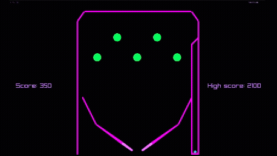

A simple pinball game with its own physics engine, built in C++ with raylib.

# Features
* A custom physics engine
* A level prototype
* Flippers, bumpers, walls, ball
* Score
* Post-processing (bloom)

# Controls
* Left/right arrow - rotate left/right flipper
* Spacebar - launch ball

# Build instructions (Linux)
1. git clone https://github.com/vilman306/RaylibPinball.git
2. cd RaylibPinball
3. mkdir build
4. cd build
5. cmake ..
6. make
7. ./RaylibPinball
